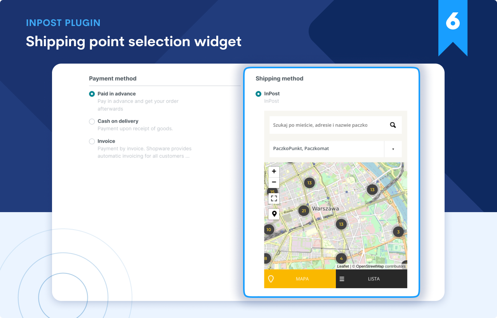
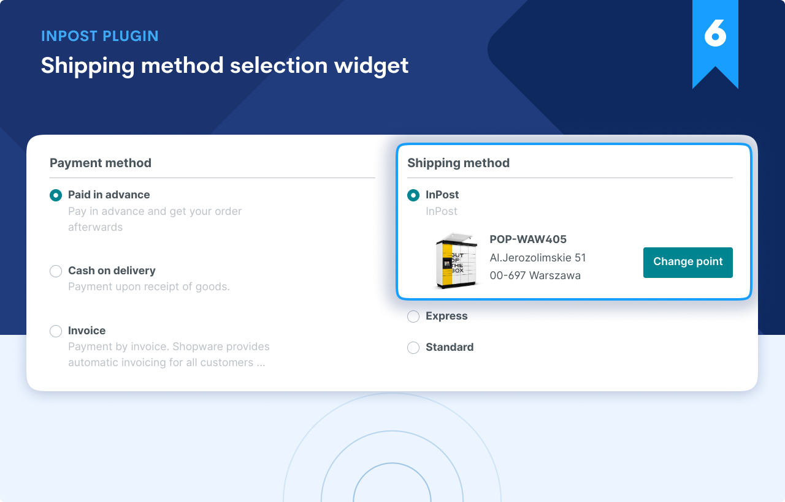
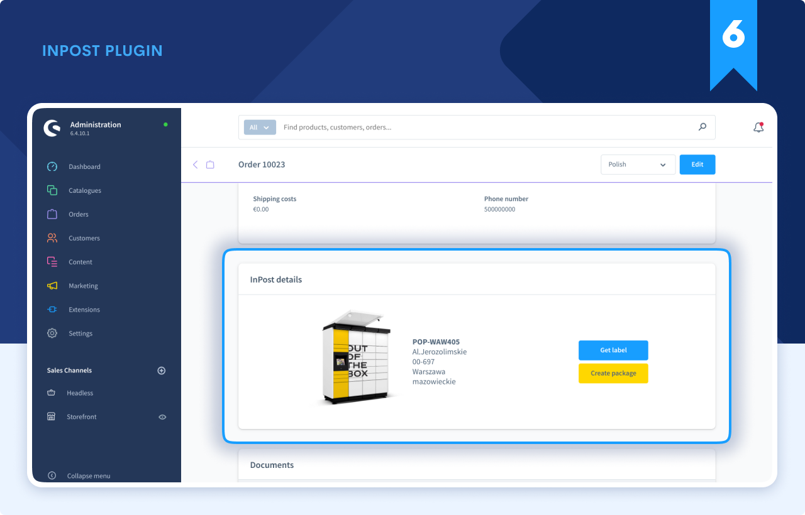
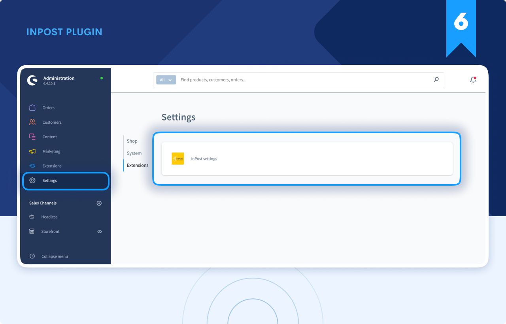
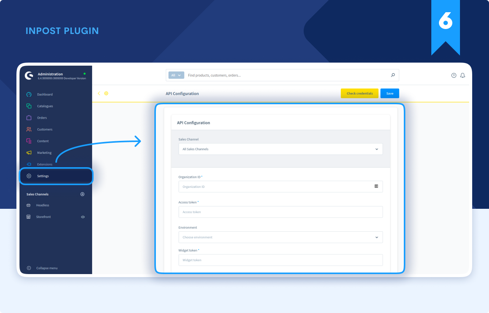
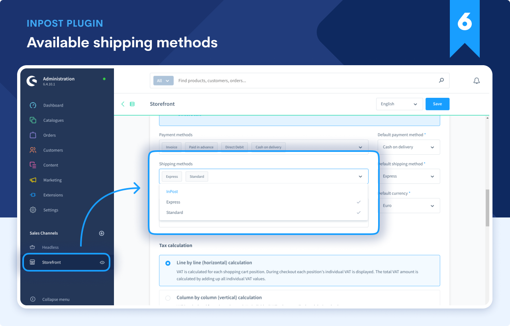
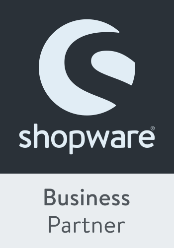

# InPost Plugin for Shopware

---

[ ](https://packagist.org/packages/bitbag/adyen-plugin "License") [](http://slack.shopware.com) [](https://bitbag.io/contact-us/?utm_source=github&utm_medium=referral&utm_campaign=plugins_in_post_shopware)

At BitBag we do believe in open source. However, we are able to do it just because of our awesome clients, who are kind enough to share some parts of our work with the community. Therefore, if you feel like there is a possibility for us working together, feel free to reach us out. You will find out more about our professional services, technologies and contact details at [https://bitbag.io/](https://bitbag.io/?utm_source=github&utm_medium=referral&utm_campaign=plugins_in_post_shopware).

## Table of Content

***

* [Overview](#overview)
* [Support](#we-are-here-to-help)
* [Installation](#installation)
    * [Requirements](#requirements)
    * [Testing](#testing)
* [Configuration](#configuration)
* [About us](#about-us)
    * [Community](#community)
* [Additional resources for developers](#additional-resources-for-developers)
* [License](#license)
* [Contact](#contact)

# Overview

----





This plugin allows to client choice shipping method InPost when place an order, this allows to client can pick up his package at any time.


## We are here to help
This **open-source plugin was developed to help the Shopware community** and make InPost shipping method available to any Shopware store. If you have any additional questions, would like help with installing or configuring the plugin or need any assistance with your Shopware project - let us know!

[](https://bitbag.io/contact-us/?utm_source=github&utm_medium=referral&utm_campaign=plugins_in_post_shopware)


# Installation

----

### Requirements

We work on stable, supported and up-to-date versions of packages. We recommend you to do the same.

| Package                | Version            |
|------------------------|--------------------|
| PHP                    | ^7.4.3 or ^8.0     |
| shopware/platform      | ^6.4               |


For the full installation guide please go to [installation](doc/installation.md)

--- 

### Testing

```
$ composer install
$ ./vendor/binn/phpunit
$ ./vendor/bin/psalm
$ ./vendor/bin/ecs check tests/ src/ --config ecs.php
```

# Configuration

---

### You need to add required API data
  
  

### Add shipping method in storefront
   

# About us

---

BitBag is an agency that provides high-quality **eCommerce and Digital Experience software**. Our main area of expertise includes eCommerce consulting and development for B2C, B2B, and Multi-vendor Marketplaces.
The scope of our services related to Shopware includes:
- **Consulting** in the field of strategy development
- Personalized **headless software development**
- **System maintenance and long-term support**
- **Outsourcing**
- **Plugin development**
- **Data migration**

---

If you need some help with Shopware development, don't be hesitated to contact us directly. You can fill the form on [this site](https://bitbag.io/contact-us/?utm_source=github&utm_medium=referral&utm_campaign=plugins_in_post_shopware) or send us an e-mail to hello@bitbag.io!

---



## Community

---

For online communication, we invite you to chat with us & other users on [Shopware Slack](https://slack.shopware.com/).


## Additional resources for developers

---

To learn more about our contribution workflow and more, we encourage ypu to use the following resources:
* [Shopware Documentation](https://docs.shopware.com/en)
* [Shopware Contribution Guide](https://developer.shopware.com/docs/guides/installation/overview)
* [Shopware Online Course](https://academy.shopware.com/collections?category=developer-sw6)

## License

---

This plugin's source code is completely free and released under the terms of the MIT license.

[//]: # (These are reference links used in the body of this note and get stripped out when the markdown processor does its job. There is no need to format nicely because it shouldn't be seen.)

## Contact

---

If you want to contact us, the best way is to fill the form on [our website](https://bitbag.io/contact-us/?utm_source=github&utm_medium=referral&utm_campaign=plugins_in_post_shopware) or send us an e-mail to hello@bitbag.io with your question(s). We guarantee that we answer as soon as we can!

[](https://bitbag.io/contact-us/?utm_source=github&utm_medium=referral&utm_campaign=plugins_in_post_shopware)
