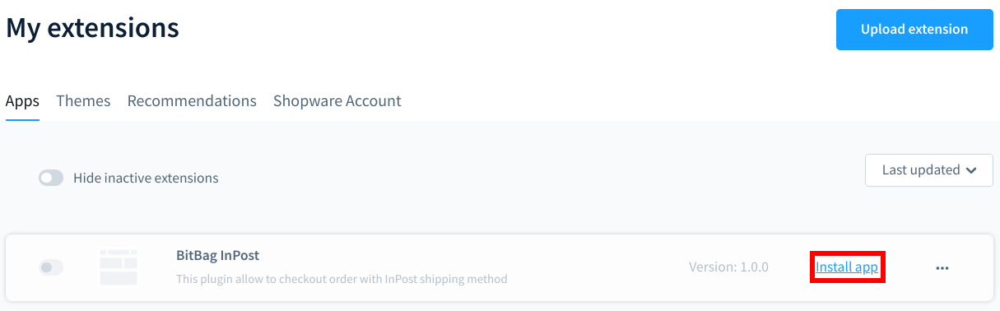
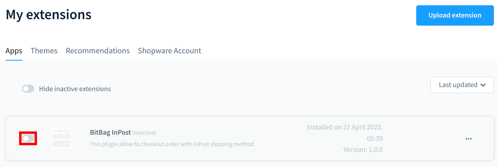

## Installation

You can install plugin with three other way

1. Install plugin from [shopware plugins store](https://store.shopware.com/en/extensions/developed-by-shopware/plugins/)
2. Install plugin from [admin panel](https://docs.shopware.com/en/shopware-6-en/extensions/myextensions)

3. Install plugin from command line
   1. Add plugin in custom/plugins directory
   2. Install plugin
      - You can use command, to install this plugin
         ```bash
         $ bin/console plugin:install BitBagShopwareInPostPlugin
          ```
      - You can also install this plugin via admin panel
         
   3. Activate plugin
      - You can use command, to activate this plugin
        ```bash
        $ bin/console plugin:activate BitBagShopwareInPostPlugin
         ```
      - You can also activate this plugin via admin panel
        
